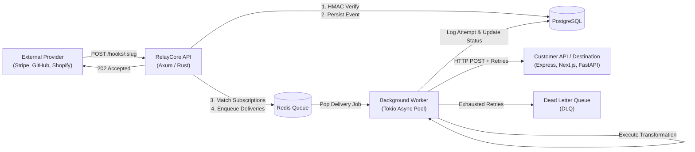

# RelayCore (Waypoint)

[](https://www.rust-lang.org/)
[](LICENSE)
[]()

> High-throughput, multi-tenant webhook ingestion, cryptographic verification, transformation, and resilient fan-out relay gateway built in **Rust** (Axum + Tokio + SQLx + PostgreSQL + Redis) and **React / TypeScript**.

---

## 📖 Complete Documentation Portal

Comprehensive, production-grade documentation is available in the [`docs/`](./docs) directory:

- 📚 **[Documentation Index & Table of Contents](./docs/README.md)**
- 💡 **[What is RelayCore & Why RelayCore?](./docs/introduction/overview.md)**
- 🏛️ **[System Architecture & Ingestion Pipeline](./docs/introduction/architecture.md)**
- ⚡ **[5-Minute Quickstart Tutorial](./docs/getting-started/quickstart.md)**
- 🛠️ **[Installation & Local Setup Guide](./docs/getting-started/installation.md)**
- 🌐 **[Environment Variables Reference](./docs/getting-started/environment-variables.md)**
- 🔑 **[Core Concepts & Mental Model](./docs/concepts/core-concepts.md)**
- 🔄 **[The Complete Event Lifecycle](./docs/concepts/event-lifecycle.md)**
- 📐 **[Retries & Exponential Backoff](./docs/concepts/retry-and-backoff.md)**
- 🔌 **[Circuit Breakers & Fault Tolerance](./docs/concepts/circuit-breaker.md)**
- 📖 **[Complete REST API Reference](./docs/api/overview.md)**
- 🚀 **[Node.js Integration Guide](./docs/integrations/nodejs.md)**
- 🛡️ **[Express.js Webhook Receiver Guide](./docs/integrations/expressjs.md)**
- 🔒 **[Security Model & Production Checklist](./docs/security/production-checklist.md)**
- 🐳 **[Production Deployment & Kubernetes](./docs/operations/deployment.md)**
- 🩺 **[Observability, Prometheus Metrics & Healthz](./docs/operations/monitoring.md)**
- ❓ **[Troubleshooting & Common Antipatterns](./docs/troubleshooting/common-issues.md)**
- 📚 **[Glossary & FAQ](./docs/reference/faq.md)**

---

## ⚡ Architecture Flow



---

## 🚀 Quick Run

### With Docker Compose:
```bash
cp .env.example .env
docker-compose up -d
```

- **API Gateway**: `http://localhost:3001`
- **Dashboard UI**: `http://localhost:5175`

### Native Run:
```bash
# Start API Gateway
cargo run -p api

# Start Delivery Worker
cargo run -p worker

# Start Frontend UI
cd ui && npm run dev
```

### Run Tests:
```bash
cargo test --workspace
```
