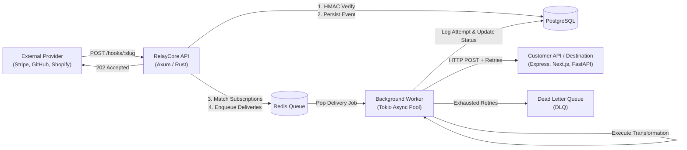

# RelayCore — Production Documentation

> **RelayCore (Waypoint)** is a high-throughput, multi-tenant webhook ingestion, verification, and resilient fan-out relay platform.

---

## 📚 Documentation Table of Contents

### 1. Introduction & Overview
- [What is RelayCore & Why RelayCore?](./introduction/overview.md) — Problem statement, core value proposition, and comparison.
- [System Architecture](./introduction/architecture.md) — Ingestion pipeline, worker dispatch loop, synchronous vs. asynchronous execution, and Mermaid topology diagrams.

### 2. Getting Started
- [Installation & Local Setup](./getting-started/installation.md) — Prerequisites, native Cargo/Node.js setup, Docker Compose, and database migrations.
- [5-Minute Quickstart Tutorial](./getting-started/quickstart.md) — End-to-end tutorial using cURL to create sources, connect destinations, and ingest events.
- [Environment Configuration](./getting-started/environment-variables.md) — Exhaustive environment variable reference for API, worker, database, and Redis.

### 3. Core Concepts & Mental Model
- [Core Concepts](./concepts/core-concepts.md) — Detailed explanations of Tenants, Sources, Events, Subscriptions, Deliveries, Attempts, DLQ, and Circuit Breakers.
- [The Complete Event Lifecycle](./concepts/event-lifecycle.md) — Step-by-step trace of a webhook from external provider ingestion to downstream delivery.
- [Retries & Exponential Backoff](./concepts/retry-and-backoff.md) — Retry calculations, jitter formula, max retry limits, and dead-letter transitions.
- [Circuit Breakers & Fault Tolerance](./concepts/circuit-breaker.md) — Consecutive failure counters, automatic tripping, half-open recovery, and manual overrides.

### 4. Complete API Reference
- [API Overview & Conventions](./api/overview.md) — Base URLs, versioning (`/api/v1`), standard error envelopes, and HTTP status codes.
- [Authentication & JWT Tokens](./api/authentication.md) — Login, token refresh, `/me` profile, and Bearer token headers.
- [API Keys](./api/api-keys.md) — Programmatic scoped credentials (`read_only` / `full`), one-time secret reveals, and key revocation.
- [Inbound Sources](./api/sources.md) — Registering webhook entrypoints (`/hooks/:slug`), HMAC verification types, and secret rotation.
- [Target Destinations](./api/destinations.md) — Downstream endpoints, timeout/retry configuration, circuit breaker controls, and test triggers.
- [Routing Subscriptions](./api/subscriptions.md) — Connecting Sources to Destinations with wildcard event filters (`payment.*`, `invoice.*`).
- [Events Stream](./api/events.md) — Ingestion endpoint (`POST /hooks/:slug`), keyset cursor pagination, sensitive raw payload viewing, and single/batch replay.
- [Deliveries & Traces](./api/deliveries.md) — Outbound dispatch monitoring, chronological attempt logs (HTTP status, latency in ms, response snippets), and delivery replay.
- [Dead Letter Queue (DLQ)](./api/dlq.md) — Quarantined delivery inspection, single item requeue, bulk retry-all, and discard actions.
- [Transformation Engine](./api/transformations.md) — Dynamic JSONPath payload reshaping and sandbox preview testing.
- [Statistics & Telemetry](./api/stats.md) — 1h/24h/7d/30d timeseries throughput, latency percentiles, destination health, and system telemetry.
- [Tenants & Quota Management](./api/tenants.md) — Workspace configuration, monthly event quotas, and daily usage breakdowns.

### 5. SDKs & Framework Integrations
- [Node.js Integration Guide](./integrations/nodejs.md) — Modern Node.js client patterns with native `fetch` and async/await.
- [Express.js Webhook Receiver](./integrations/expressjs.md) — Complete production Express.js receiver with raw body capture and HMAC signature verification.
- [Webhook Sender Guide](./integrations/sender-guide.md) — How to publish outbound events into RelayCore from backend microservices.
- [Webhook Receiver Best Practices](./integrations/receiver-guide.md) — Fast 200 acknowledgments, asynchronous queueing, and idempotency key handling.

### 6. Security & Hardening
- [Security Model & Isolation](./security/security-model.md) — Multi-tenant database segregation, constant-time HMAC validation, and AES-256 secret encryption at rest.
- [Production Hardening Checklist](./security/production-checklist.md) — Pre-deployment security checklist covering secrets, TLS, rate limits, and audit logs.

### 7. Operations & Infrastructure
- [Production Deployment](./operations/deployment.md) — Docker Compose, Kubernetes manifests, horizontal API/worker scaling, and database connection pooling.
- [Observability & Monitoring](./operations/monitoring.md) — Liveness probes (`/healthz`), Prometheus scraping (`/metrics`), Grafana dashboard metrics, and alert rules.

### 8. Troubleshooting & Reference
- [Troubleshooting Common Issues](./troubleshooting/common-issues.md) — Step-by-step diagnostic workflows for database errors, worker lag, and signature failures.
- [Common Architectural Mistakes](./troubleshooting/common-mistakes.md) — Antipatterns to avoid in webhook engineering.
- [Glossary of Terms](./reference/glossary.md) — Definitions for infrastructure terms.
- [Frequently Asked Questions (FAQ)](./reference/faq.md) — Common questions with authoritative answers.

---

## ⚡ Quick Architecture Overview

