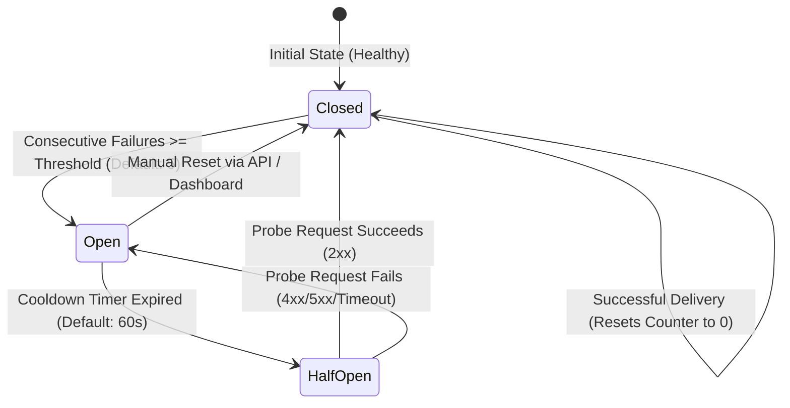

# Circuit Breakers & Fault Tolerance

RelayCore incorporates an automated **Circuit Breaker** on every Target Destination to safeguard both your downstream infrastructure and RelayCore's worker task pool.

---

## 🎯 Why Circuit Breakers Exist

When a downstream receiver crashes or enters a degraded state (e.g. database locks, out-of-memory errors):
- Without circuit breakers: Hundreds or thousands of concurrent worker threads attempt to send HTTP requests, continually hammering the failing server and exhausting network sockets.
- With circuit breakers: RelayCore detects repeated consecutive failures, immediately trips the circuit `open`, pauses delivery dispatches to that endpoint, and preserves queued deliveries for later recovery.

---

## 🔄 Circuit Breaker State Machine



---

## 🚦 Circuit States Explained

### 1. `closed` (Healthy / Normal Operation)
- The destination operates normally.
- Deliveries are executed immediately by background workers.
- Each successful delivery resets `consecutive_failures` back to `0`.

### 2. `open` (Tripped / Paused)
- When `consecutive_failures >= CIRCUIT_BREAKER_FAILURE_THRESHOLD` (e.g. 5 failures in a row), the circuit trips `open`.
- Workers skip active dispatches to this endpoint. New deliveries remain queued in a `pending` state.
- In the dashboard, an alert badge warns operators: `Circuit Breaker Open`.

### 3. `half_open` (Probe / Recovery Mode)
- After a configurable cooldown interval (`CIRCUIT_BREAKER_COOLDOWN_SECS`, default 60s), the circuit transitions to `half_open`.
- RelayCore dispatches a single canary probe delivery:
  - If the probe succeeds (HTTP 2xx): The circuit closes, and normal queue processing resumes.
  - If the probe fails: The circuit returns to `open` for another cooldown period.

---

## 🛠️ Manual Circuit Controls

Operators can manually reset or pause destinations via the REST API or Dashboard:

### Reset an Open Circuit
```bash
curl -X POST http://localhost:3001/api/v1/destinations/<DESTINATION_ID>/resume \
  -H "Authorization: Bearer <TOKEN>"
```

### Manually Pause Deliveries to a Destination
```bash
curl -X POST http://localhost:3001/api/v1/destinations/<DESTINATION_ID>/pause \
  -H "Authorization: Bearer <TOKEN>"
```

### Test Destination Endpoint Health
```bash
curl -X POST http://localhost:3001/api/v1/destinations/<DESTINATION_ID>/test \
  -H "Authorization: Bearer <TOKEN>"
```

---

## ⏭️ Next Steps

- Explore the [Destinations API Reference](../api/destinations.md).
- Learn about the [Dead Letter Queue (DLQ)](../api/dlq.md).
- Review [Observability & Prometheus Metrics](../operations/monitoring.md).
