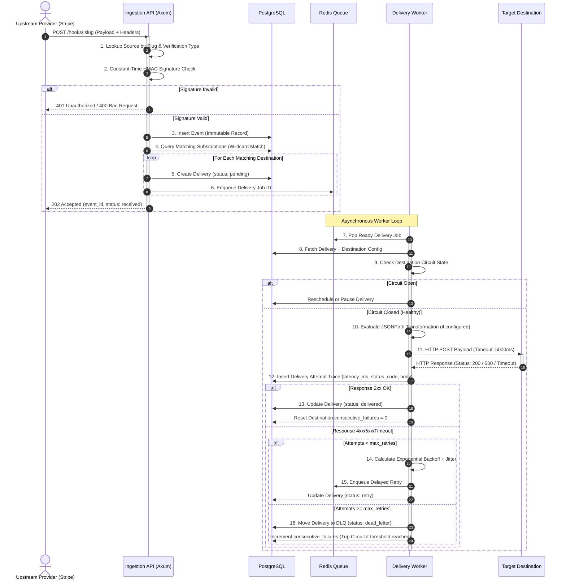

# The Complete Event Lifecycle

This document provides an in-depth, technical walkthrough of what happens from the moment an external webhook arrives at RelayCore until it is successfully delivered to downstream destinations or quarantined in the Dead Letter Queue.

---

## 🔄 The Lifecycle Pipeline

---

## 🔍 Detailed Stage Breakdown

### Stage 1: Ingestion & Verification
1. An external provider (e.g. Stripe, GitHub, Shopify) executes an HTTP `POST` to `/hooks/:slug`.
2. RelayCore resolves the source by `slug` and retrieves its configured verification strategy.
3. The cryptographic verification engine checks signature headers:
   - Compares computed HMAC-SHA256 digests in constant time.
   - Enforces timestamp tolerance windows (e.g. rejects timestamps older than 300 seconds to prevent replay attacks).
4. If signature validation fails, RelayCore logs the failed verification attempt to `source_verification_logs` and rejects the request immediately.

### Stage 2: Event Persistence & Subscription Fan-Out
1. Upon signature verification, RelayCore writes an immutable `Event` record to PostgreSQL containing the raw body, headers, and event type.
2. In the same atomic database transaction, RelayCore queries all active subscriptions for the source.
3. Subscriptions matching the event type (e.g. pattern `order.*` matching `order.fulfilled`) generate a new `Delivery` record.
4. The delivery job IDs are pushed to the Redis worker stream.
5. The API server returns `202 Accepted` to the upstream provider within milliseconds.

### Stage 3: Asynchronous Worker Execution
1. A Tokio worker thread pulls the delivery job from Redis.
2. The worker checks if the target destination's circuit breaker is open.
3. If active, the worker applies any configured JSONPath transformations to reshape the payload.
4. The worker executes an HTTP POST to the destination URL with strict timeout enforcement.

### Stage 4: Attempt Logging & Retry Backoff
1. The worker records a `delivery_attempt` record with HTTP status, roundtrip latency in milliseconds, timestamp, and response body snippet.
2. **Success (2xx)**: The delivery is marked as `delivered`, and consecutive failure counters are reset to 0.
3. **Failure (4xx/5xx/Timeout)**:
   - If `attempt_count < max_retries`, RelayCore calculates exponential backoff with randomized jitter and enqueues a delayed retry in Redis.
   - If `attempt_count >= max_retries`, the delivery transitions to `dead_letter` and enters the **Dead Letter Queue (DLQ)**.

---

## ⏭️ Next Steps

- Explore [Retries & Exponential Backoff](./retry-and-backoff.md).
- Learn about [Circuit Breakers & Fault Tolerance](./circuit-breaker.md).
- Review the [Deliveries API](../api/deliveries.md).
