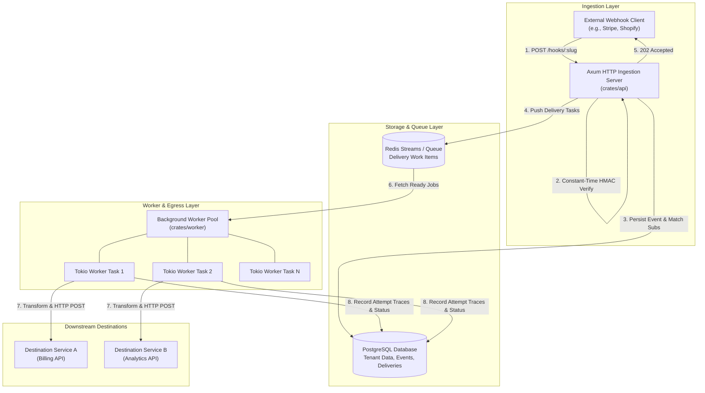
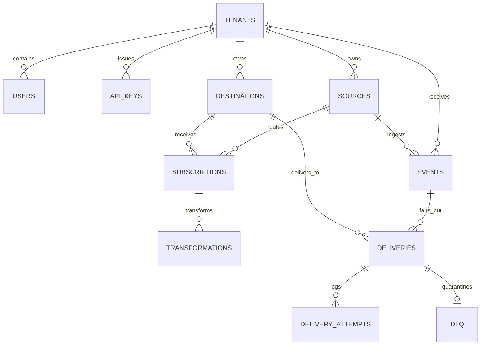

# System Architecture

RelayCore is built in **Rust** using asynchronous Tokio runtimes, Axum HTTP routers, SQLx for connection-pooled PostgreSQL persistence, and Redis for distributed message queuing.

---

## 🏛️ High-Level System Architecture

---

## ⚙️ Component Breakdown

### 1. Ingestion API Server (`crates/api`)
- **Technology**: Rust + Axum + Tower HTTP.
- **Responsibility**: Inbound webhook receipt, cryptographic signature verification, tenant authorization, REST administration APIs, and health/Prometheus metric reporting.
- **Performance**: Returns `202 Accepted` within `<5ms`. No heavy downstream HTTP requests or complex transformations are executed in the HTTP request thread.

### 2. Domain & Routing Logic (`crates/domain` & `crates/core`)
- **Responsibility**: Encapsulates business logic, subscription matching algorithms, wildcard event type evaluation (`order.*` matches `order.created`), cryptographic signature engines (HMAC-SHA256, Stripe v1, GitHub, Shopify), and circuit breaker state calculation.

### 3. Data Layer (`crates/data`)
- **Technology**: SQLx + PostgreSQL + Redis.
- **Responsibility**: Strong consistency, multi-tenant row-level partitioning by `tenant_id`, atomic event ingestion transactions, delivery queueing, and historical attempt tracing.

### 4. Background Delivery Worker (`crates/worker`)
- **Technology**: Tokio Asynchronous Task Pool + Reqwest HTTP Client.
- **Responsibility**:
  - Pulls delivery work items from Redis.
  - Checks target destination circuit breaker state.
  - Applies JSONPath payload transformations.
  - Dispatches HTTP POST requests to customer endpoints with configurable timeouts (e.g. 5000ms).
  - Evaluates response HTTP status codes (2xx = delivered, 4xx/5xx/timeout = retry or dead letter).
  - Computes exponential backoff with randomized jitter.
  - Quarantines permanently failed deliveries to the Dead Letter Queue (DLQ).

---

## ⏱️ Synchronous vs. Asynchronous Operations

| Phase | Execution Mode | Executed By | SLA / Timeout |
| :--- | :--- | :--- | :--- |
| **Inbound Webhook Receipt** | Synchronous | `crates/api` | `< 5ms` |
| **Signature Validation** | Synchronous | `crates/core` | `< 1ms` (Constant Time) |
| **Event Persistence** | Synchronous | PostgreSQL | `< 3ms` |
| **Subscription Fan-Out** | Synchronous | Ingestion Transaction | `< 2ms` |
| **Delivery Dispatch** | Asynchronous | `crates/worker` | Up to configured `timeout_ms` |
| **Retry Backoff Delay** | Asynchronous | Redis Delayed Queue | Configurable (e.g. $2^n \times 10s$) |
| **Payload Transformation** | Asynchronous | `crates/worker` | `< 1ms` |
| **Circuit Breaker Check** | Asynchronous | `crates/worker` | In-memory atomic check |

---

## 🗄️ Database Entity-Relationship Model

---

## ⏭️ Next Steps

- Proceed to the [Installation & Local Setup](../getting-started/installation.md).
- Follow the [5-Minute Quickstart](../getting-started/quickstart.md).
- Review [Environment Variables](../getting-started/environment-variables.md).
