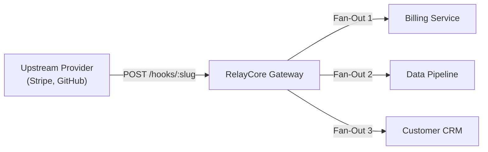

# What is RelayCore?

**RelayCore (Waypoint)** is a high-performance, multi-tenant webhook ingestion, verification, transformation, and resilient dispatch platform engineered in Rust.

---

## 🎯 The Webhook Problem

In modern cloud architectures, webhooks are the primary mechanism for asynchronous inter-service communication (e.g., Stripe payment events, GitHub push triggers, Shopify inventory updates, internal microservice events). However, managing webhooks directly presents serious operational challenges:

1. **Downstream Unreliability & Cascading Failures**: If a receiving application server goes down, restarts, or encounters database locking, webhooks sent directly from third-party providers are permanently dropped or lost.
2. **Slow Execution & Gateway Timeouts**: Ingesting webhooks synchronously and performing complex database transactions during the HTTP request can exceed provider timeouts (typically 5–10 seconds), causing providers to disable your webhook endpoints.
3. **Complex Cryptographic Signatures**: Different providers use distinct signature formats (Stripe `t=...,v1=...`, GitHub HMAC-SHA256, Shopify Base64 HMAC). Developers repeatedly rewrite signature validation logic across every microservice.
4. **Lack of Fan-Out**: Third-party providers typically allow you to specify only one target URL per event type. Routing the same event to multiple microservices (e.g., Billing API, Analytics, CRM, Audit Service) requires custom proxy servers.
5. **No Visibility or Replayability**: Once an event fails, debugging what happened (the raw payload, response headers, HTTP status codes, execution latencies) is nearly impossible without centralized tracing and 1-click replay tooling.

---

## 💡 How RelayCore Solves It

RelayCore sits as an operational gateway between external webhook providers and your internal applications:

### Core Capabilities:

- ⚡ **Ultra-Fast Non-Blocking Ingestion (`<5ms`)**: RelayCore validates cryptographic signatures in constant time, records the event in PostgreSQL, enqueues delivery jobs to Redis, and immediately returns `202 Accepted` to upstream providers.
- 🛡️ **Cryptographic Verification**: Native verification engines for Generic HMAC-SHA256, Stripe v1 timestamped headers, GitHub `X-Hub-Signature-256`, and Shopify signatures with replay timestamp defense.
- 🔀 **Subscription-Based Fan-Out Routing**: Connect a single Inbound Source to multiple Target Destinations with wildcard event filtering (`payment.*`, `invoice.paid`, or `*`).
- 🔄 **Automated Retries with Exponential Backoff & Jitter**: Failed deliveries are retried automatically with exponential backoff ($2^n \times \text{base} + \text{jitter}$) across configurable retry budgets (e.g., 5 retries over 24 hours).
- 🔌 **Automated Circuit Breakers**: If a target endpoint encounters repeated consecutive timeouts or 5xx server errors, RelayCore trips the circuit open to protect downstream servers and preserve system resources.
- 🧪 **JSONPath Transformation Engine**: Dynamically reshape, filter, and restructure incoming webhook payloads before delivery using lightweight JSONPath templates.
- 📦 **Dead Letter Queue (DLQ) & 1-Click Replays**: Exhausted deliveries are quarantined with complete attempt logs (HTTP status codes, latency in ms, error messages, and response snippets) and can be replayed individually or in bulk.
- 🏢 **Multi-Tenant Isolation**: Complete database-level tenant isolation, scoped API keys (`read_only` / `full`), and organization usage quota tracking.

---

## 👥 Who is RelayCore For?

- **Backend & Platform Engineers**: Who need a dependable event broker for third-party integrations without maintaining bespoke queueing infrastructure.
- **SaaS & Enterprise Platforms**: Who receive millions of webhook events daily and require strict 99.999% delivery guarantees, audit logging, and tenant isolation.
- **Microservice Architectures**: That need to fan-out single events to multiple downstream services with per-endpoint retry policies and transformation mappings.

---

## ⏭️ Next Steps

- Explore the [System Architecture](./architecture.md).
- Follow the [5-Minute Quickstart Tutorial](../getting-started/quickstart.md).
- Learn about [Core Concepts](../concepts/core-concepts.md).
